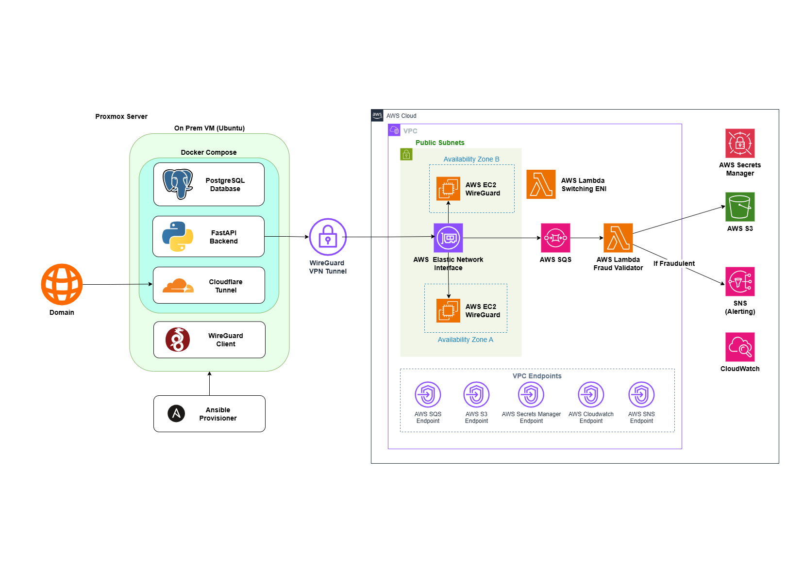

# PayCore Hybrid B2B Payment Processing Middleware


A production-grade hybrid cloud payment middleware that runs a FastAPI application on an on-premises server, connected to AWS serverless infrastructure via WireGuard VPN. Designed as a reusable base for engineers who need a secure, auditable payment backend without going fully cloud-native.

This is not a tutorial scaffold. The infrastructure, networking, secrets management, and deployment pipeline are all production-pattern implementations.

---

## Architecture

<!-- Replace this comment with your architecture diagram image -->
<!-- Recommended tool: draw.io, Excalidraw, or Lucidchart -->
<!-- Suggested filename: docs/architecture.png -->




### Network topology

| Node | WireGuard IP | Role |
|---|---|---|
| On-prem Proxmox VM | `10.10.0.1` | Runs Docker stack, initiates VPN tunnel |
| AWS EC2 node 0 | `10.10.0.2` | Primary WireGuard gateway, Elastic IP attached |
| AWS EC2 node 1 | `10.10.0.3` | Standby, receives Elastic IP on failover |

Lambda reaches the on-prem API at `http://10.10.0.1` through the VPC route table (`10.10.0.0/24 → EC2 node 0 ENI`). The API port is bound exclusively to the WireGuard interface — it is not reachable from the public internet.

---

## What This Project Demonstrates

**Hybrid cloud networking** — WireGuard VPN bridging an on-premises VM to a VPC, with EC2 acting only as a VPN gateway. No application logic runs in EC2.

**Layered security**
- PAN (Primary Account Number) tokenisation — real card numbers never persist to the database or message queue
- JWT authentication for merchant API access
- API key isolation for Lambda-to-API callbacks (`X-API-Key` separate from JWT)
- AWS KMS (Key Management Service) encrypting both S3 objects and Secrets Manager entries
- `bcrypt_sha256` password hashing, bypassing bcrypt's 72-byte truncation vulnerability

**Serverless fraud detection** — Lambda validates every transaction, archives to S3 before processing, applies threshold rules, and calls back to the on-prem API to update status

**High availability** — CloudWatch alarm detects EC2 node 0 failure and triggers a Lambda that reassigns the Elastic IP to the standby node

**Infrastructure as code end-to-end** — Terraform manages all AWS resources with a modular layout; Ansible handles VM provisioning and application deployment from a single command

**Immutable base image pattern** — Proxmox VM template built with cloud-init, provisioned with Ansible, then converted to an immutable template to guarantee consistent clones

---

## Tech Stack

| Layer | Technology |
|---|---|
| API | FastAPI 0.111, Python 3.12, uvicorn |
| Database | PostgreSQL 17 (Docker) |
| ORM + Migrations | SQLAlchemy 2.0, Alembic |
| Auth | python-jose (JWT, HS256), passlib bcrypt_sha256 |
| Message queue | AWS SQS (Simple Queue Service) with DLQ |
| Event processing | AWS Lambda (Python 3.12) |
| Alerting | AWS SNS (Simple Notification Service) |
| Audit storage | AWS S3 + SSE-KMS |
| Secrets | AWS Secrets Manager + KMS CMK (Customer Master Key) |
| VPN | WireGuard (on-prem ↔ AWS EC2) |
| Reverse proxy | nginx |
| Tunnel | Cloudflare Tunnel (cloudflared) |
| Containerisation | Docker Compose |
| Infrastructure | Terraform 1.14, AWS provider 6.22 |
| Configuration | Ansible, Ansible Vault |
| Hypervisor | Proxmox VE |

---

## Repository Structure

```
paycore-hybrid-payment-infra/
├── app/
│   ├── backend/
│   │   ├── routers/          # payments, transactions, auth, health
│   │   ├── services/         # auth_service, tokeniser, dependencies
│   │   ├── db_models/        # SQLAlchemy ORM models
│   │   ├── response_schemas/ # Pydantic request/response models
│   │   ├── alembic/          # migration versions + env.py
│   │   ├── main.py           # FastAPI app, CORS, router registration
│   │   ├── config.py         # Pydantic BaseSettings, env var loading
│   │   ├── database.py       # engine, session factory, Base
│   │   └── logger.py         # JSON structured logging
│   ├── nginx/conf.d/         # nginx reverse proxy config
│   ├── docker-compose.yml    # db, api, nginx, cloudflared
│   └── setup.sh              # fetch secrets + bring up stack
│
├── aws-infra/
│   ├── dev/                  # environment entry point (main.tf, variables.tf)
│   └── modules/
│       ├── compute/          # Lambda validator, IAM role, Secrets Manager
│       ├── kms/              # KMS key + alias
│       ├── messaging/        # SQS queue, DLQ, SNS topic
│       ├── storage/          # S3 bucket, versioning, KMS encryption
│       └── vpn_networking/   # VPC, subnets, EC2 WireGuard nodes, EIP failover
│
├── on-prem/
│   ├── ansible/
│   │   ├── configure.yml     # WireGuard setup on on-prem VM
│   │   ├── deploy_app.yml    # git pull, secrets fetch, docker compose up
│   │   ├── wg0.conf.j2       # Jinja2 WireGuard config template
│   │   └── inventory.ini     # Ansible targets
│   └── cloner.sh             # Clone Proxmox template to working VM
│
└── template/
    ├── stage1.sh             # Create base VM from Ubuntu cloud image
    ├── stage2.sh             # Shutdown + convert to immutable template
    └── ansible/
        └── provision-base.yml  # Docker, WireGuard tools, SSH hardening
```

---

## Local Environment

This project was built on the following setup. You do not need an identical environment, but understanding the topology helps when adapting the network configuration.

```
Windows 11 Host
└── VMware Workstation Pro
    ├── Ubuntu 22.04 (control plane — NAT)
    │     Terraform, Ansible, AWS CLI, Docker
    │     This is where all commands in this README are run
    │
    └── Proxmox VE (NAT)
          └── paycore-on-prem VM  (192.168.123.10)
                Docker Compose stack — FastAPI, PostgreSQL, nginx, cloudflared
```

The on-prem VM has no public IP. Cloudflare Tunnel handles inbound public traffic. AWS Lambda reaches the VM through the WireGuard VPN — the EC2 nodes act as the VPN gateway.

---

## Prerequisites

**On your control machine (Ubuntu 22.04 in this setup):**

- AWS CLI v2, configured with credentials that have permissions to provision the resources in `aws-infra/`
- Terraform `~> 1.14`
- Ansible (`ppa:ansible/ansible`, not the snap)
- `jq`
- WireGuard tools (`wireguard-tools`) for key generation

**AWS account:**
- SQS, Lambda, S3, SNS, KMS, Secrets Manager, EC2, VPC — all used

**Cloudflare:**
- A domain managed in Cloudflare
- A Zero Trust tunnel token (free tier works)

---

## Deployment Overview

Full step-by-step instructions are in the [project runbook](docs/runbook.md). The sequence at a high level:

**1. Build the Proxmox golden image**
```bash
# Run inside Proxmox shell
bash template/stage1.sh
ansible-playbook -i template/ansible/inventory.ini template/ansible/provision-base.yml
bash template/stage2.sh
```

**2. Clone the template to a working VM**
```bash
# Run inside Proxmox shell
bash on-prem/cloner.sh
```

**3. Generate WireGuard key pairs**
```bash
# Run once per node (on-prem VM + 2x EC2)
wg genkey | tee privatekey | wg pubkey > publickey
```

**4. Provision AWS infrastructure**
```bash
cd aws-infra/dev
terraform init
terraform apply -var-file="dev.tfvars"
```

**5. Configure WireGuard and deploy the application**
```bash
bash on-prem/ansible/run.sh
```

This single command runs `configure.yml` (WireGuard setup) then `deploy_app.yml` (secrets fetch from AWS, git pull, docker compose up, health check).

---

## Testing

Once the stack is deployed and `https://your-domain.xyz/api/health` returns `200`:

### 1. Register a merchant account

```bash
curl -X POST https://your-domain.xyz/api/auth/register \
  -H "Content-Type: application/json" \
  -d '{"username": "testmerchant", "password": "securepassword123"}'
```

Expected: `{"message": "User registered successfully", "merchant_id": "Merchant-XXXXXXXX"}`

### 2. Get an access token

```bash
curl -X POST https://your-domain.xyz/api/auth/login \
  -H "Content-Type: application/json" \
  -d '{"username": "testmerchant", "password": "securepassword123"}'
```

Expected: `{"access_token": "<jwt>", "token_type": "bearer"}`

### 3. Submit a normal payment

```bash
curl -X POST https://your-domain.xyz/api/payments/ \
  -H "Content-Type: application/json" \
  -H "Authorization: Bearer <token>" \
  -d '{"pan": "4111111111111111", "amount": 5000, "currency": "NGN"}'
```

Expected: `{"status": "queued", "token": "<uuid>", "masked_pan": "**** **** **** 1111", ...}`

After a few seconds, poll the transaction:

```bash
curl https://your-domain.xyz/api/transactions/<token> \
  -H "Authorization: Bearer <token>"
```

Expected: `"status": "processed"` — Lambda processed it, PATCH callback updated the DB.

### 4. Trigger the fraud detection

Submit an amount above the 10,000,000 NGN threshold:

```bash
curl -X POST https://your-domain.xyz/api/payments/ \
  -H "Content-Type: application/json" \
  -H "Authorization: Bearer <token>" \
  -d '{"pan": "4111111111111111", "amount": 15000000, "currency": "NGN"}'
```

Expected results:
- Transaction status becomes `"flagged"`
- SNS email alert arrives at the address in your `dev.tfvars`
- Raw payload archived in S3 at `transactions/<token>.json`

Verify the S3 archive:

```bash
aws s3 ls s3://<your-bucket>/transactions/
aws s3 cp s3://<your-bucket>/transactions/<token>.json -
```

### 5. Health check

```bash
curl https://your-domain.xyz/api/health
# {"api": "ok", "database": "ok"}
```

### Fraud rule reference

| Rule | Condition | Result |
|---|---|---|
| High-value transaction | `amount > 10,000,000` (NGN) | `flagged` + SNS alert |
| Unsupported currency | Not in `[NGN, USD, EUR]` | `flagged` + SNS alert |
| All other transactions | Pass both checks | `processed` |

---

## Adapting This for Your Own Project

The core pattern — on-premises app server + WireGuard VPN to AWS + Lambda async processing — is reusable. The project-specific values to replace are:

| Component | This project | Replace with |
|---|---|---|
| WireGuard subnet | `10.10.0.0/24` | Any private range |
| On-prem VM IP | `192.168.123.10` | Your server LAN IP |
| SQS / SNS / S3 / KMS names | `paycore-*` | Your project name |
| Secrets Manager prefix | `paycore/internal/*` | Your project prefix |
| CORS origin | `victorojeje.xyz` | Your domain |
| DB name | `paycore` | Your project name |

The Alembic migration pattern, JWT dependency injection, Lambda callback auth, Docker Compose dependency chain, and VPC endpoint set are all portable as-is.

---

## Known Limitations (Dev Configuration)

These are intentional trade-offs for a dev/homelab environment, not production-ready as-is:

- **Local Terraform backend** — `dev.tfstate` is on disk. Production should use S3 backend with DynamoDB state locking.
- **S3 Object Lock disabled** — `force_destroy = true` and object lock is commented out. Enable `COMPLIANCE` mode with retention for production audit requirements.
- **Secrets Manager `recovery_window_in_days = 0`** — immediate deletion enabled for fast iteration. Set to `7` minimum in production.
- **Route table failover gap** — the failover Lambda moves the Elastic IP but does not update VPC route table entries (which remain pointing to EC2 node 0's ENI). Full route table failover requires additional Lambda logic.
- **Single-region** — no cross-region replication on S3 or multi-region SQS setup.
- **No ledger or cash flow engine** — this system validates and processes payment events but does not maintain merchant balances, settlement records, or fund movement. It is a transaction validator and status processor, not a full payment platform. Extending it toward real financial flows would require a double-entry ledger, reconciliation layer, and settlement logic.

---

## Contact

**Victor Ogechukwu Ojeje**
Cloud & DevOps Engineer

- LinkedIn: https://www.linkedin.com/in/victorojeje/
- Blog: https://dev.to/escanut
- Email: ojejevictor@gmail.com 